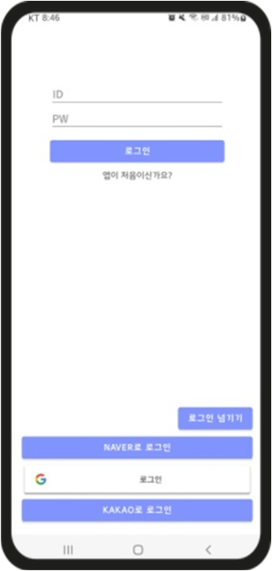
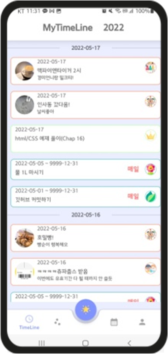
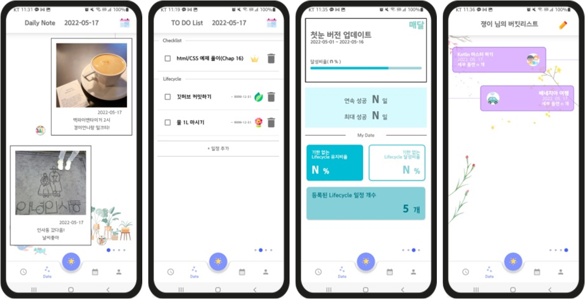
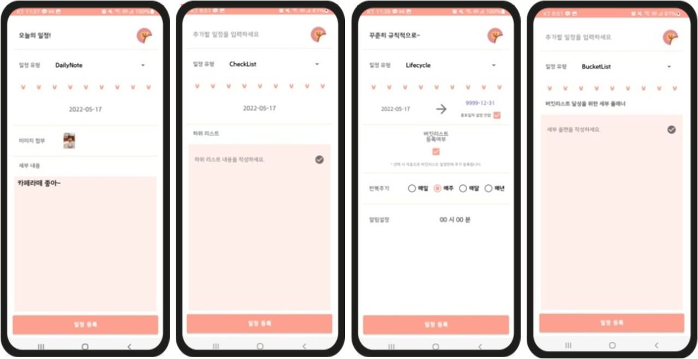
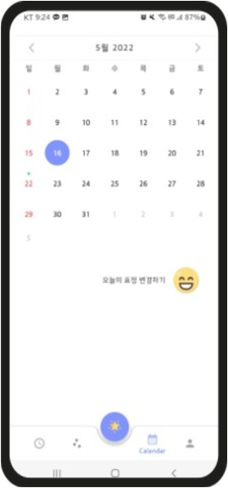
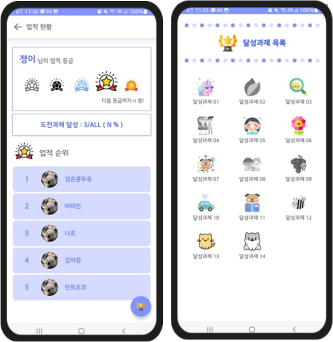
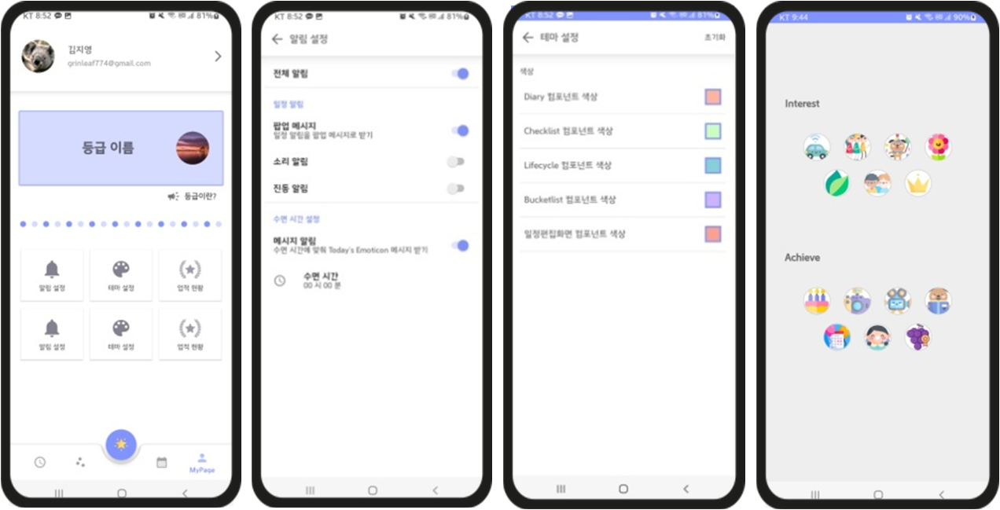

# 📅 [ 첫눈 OneSightDiaryPlanner (Android Native App) ] 
### 🎯 안드로이드 네이티브 앱 1인 제작 프로젝트 
* 일상 기록용 다이어리와 기간별 일정 플래너를 한 눈에 볼 수 있도록 통합하여 만든 일정 관리 앱 제작
* <strong>앱 배포 마켓 주소 : http://kkpk.dothome.co.kr/KuKuKuPuTeamProject/ </strong>

## 📝 <strong>프로젝트 개요</strong>
1. 프로젝트 명 : 첫눈 OnesightDiaryPlanner
2. 개발 기간 : 2022.04.11 ~ 05.22 (6주)
3. 개발 인원 : 1인
4. 개발 목표
   * 사용자에게 받은 데이터를 멤버로 가지는 클래스를 기반으로 하여, 다양한 방법으로 데이터를 활용하는 연습
   * 백엔드 연동 및 네트워크 작업 연습
6. 담당 역할 : 기획, 디자인, 레이아웃 설계, 기능 개발
7. 개발 환경

|OS|개발도구|개발언어|DB|
|------|---|---|--|
|Window 10|Android Studio, Visual Studio Code|Kotlin, PHP|Firebase, Dothome

## 🛠 <strong>주요 구현기술</strong>
* 동적 퍼미션 허가 요청 작업
* 네트워크 작업 – Retrofit2 라이브러리 활용, 백엔드 구현 및 DB 연동
* 중첩 RecyclerView, ActionBar, BottomNavigationView, FloatingButton 등을 활용한 레이아웃 구성
* Firebase Storage, Firestore, Firebase Auth 를 이용한 사용자 계정 관리

## 📌 사용된 라이브러리
* 원형 이미지뷰 라이브러리 : CircleImageView(hdodenhof)
* 이미지 로드 라이브러리 : Glide(bumptech)
* 캘린더 라이브러리 : https://github.com/ApplikeySolutions/CosmoCalendar.git
* AndroidX 라이브러리 : Swiperefreshlayout(화면 갱신-당겨서 리프레시)
* Firebase SDK : storage, firestore, auth, messaging
* Google 로그인 : play-services-auth
  
# ⛏ <strong>작업 코드 및 실행화면 🔨</strong>

## 📱  <strong>앱 주요 실행화면</strong>
|로그인 화면|메인 화면 (타임라인)|일정화면|
|---|---|---|
||||

|일정 등록화면|캘린더 화면|
|---|---|
|||

|업적 화면|설정 화면|
|---|---|
|||
